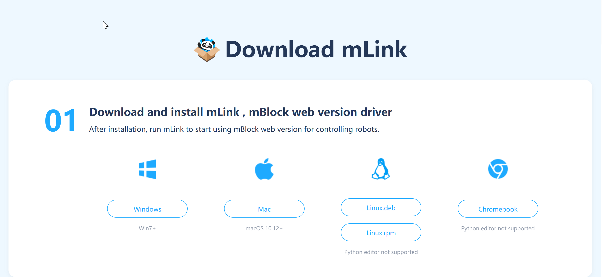
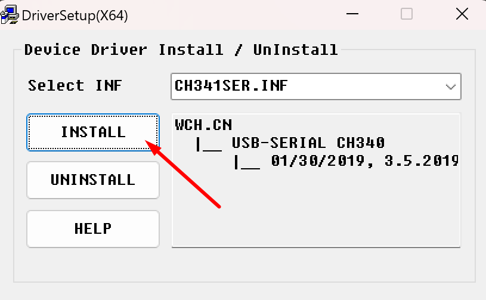
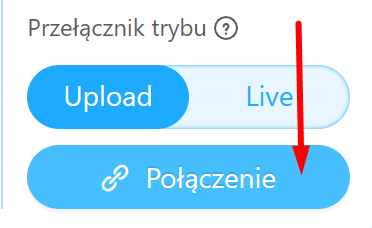
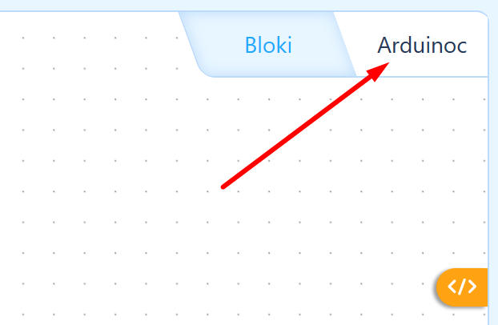
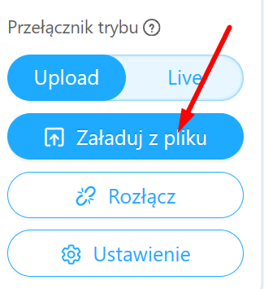
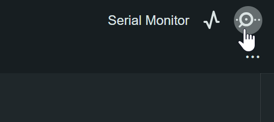
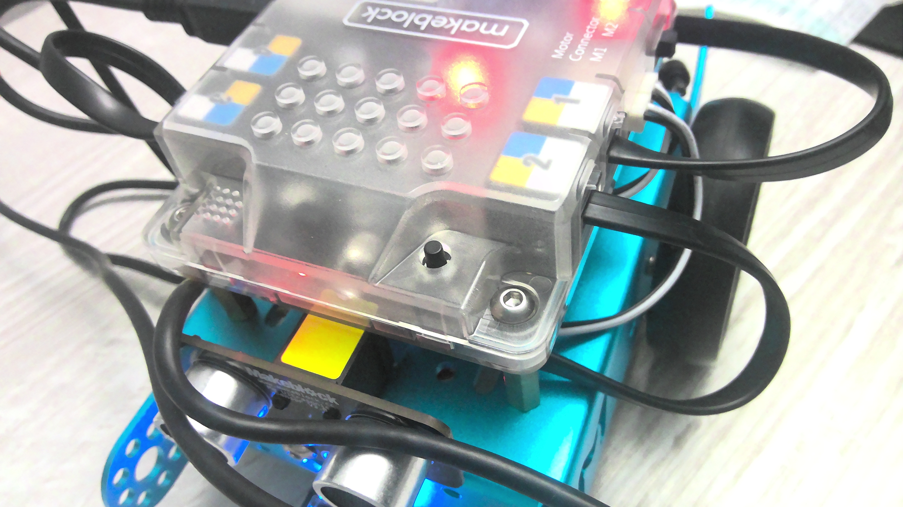
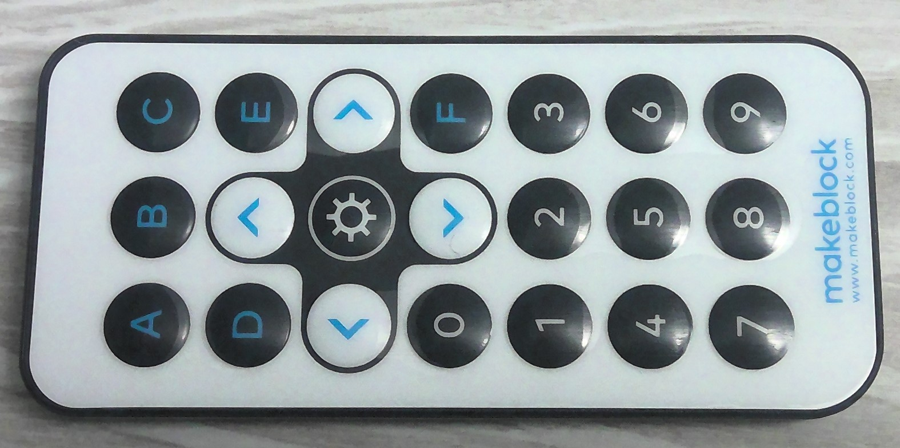

<h1 style="color:#7fba00">Podręcznik użytkownika dla <b>mBot</b> przy użycia języku <span style="color:#00a4ef">Arduino</span></h1>

Informacje zawarte w tym podręczniku mogą zawierać błędy, dziękuję za wyrozumiałość.

IDE wykorzystywane do **programowania urządzenia online** mBot v1.1. dostępne pod linkiem: https://ide.mblock.cc/

Kiedy chcemy używać jedynie kodu Arduino o wiele wygodniej będzie nam pracować w **Arduino IDE**, [instrukcja konfiguracji oprogramowania](./docs/ArduinoIDE.md).

<h2 style="color:#ffb900">Instalacja wymaganego oprogramowania</h2> 

Jeżeli chcemy wgrywać programy do naszego mBota przy pomocy połączenia kablowego USB A->B, musimy uprzednio zainstalować odpowiednie oprogramowanie.

>Instalator oprogramowania _mLink_ dostępny jest pod linkiem: https://www.mblock.cc/en/download/mlink/

[](./ss/Screenshot_1.png)

Wybieramy oprogramowanie odpowiednie dla naszego systemu. 

> <span style="color:#f25022; font-weight: 700;"> Poniższe czynności na podłączonym oraz uruchomionym urządzeniu! </span>

Przechodząc poprzez proces instalacji, poza samym oprogramowaniem mLink instalujemy również odpowiednie sterowniki.

[](./ss/Screenshot_3.png)

<h2 style="color:#ffb900">Połączenie z urządzeniem w IDE</h2>

Aby móc importować nasze programy do urządzenia mBot, musimy je połączyć wewnątrz oprogramowania do kodowania. Robimy to wybierając u dołu okranu przycisk "połączenie"

[](./ss/Screenshot_2.png)

Zatwierdzamy konfigurację połączenia na porcie **COM3** przy pomocy **USB**. W tym momencie nasze urządzenia powinny być ze sobą połączone.

<h1 style="color:#7fba00">PROGRAMOWANIE</h1>

IDE mBlock umożliwia tworzenie programów na dwa sposoby

- programowanie blokowe - _Scratch_
- programowanie obiektowe - _Arduino_

Tworząc program blokowy mamy możliwość podglądu kodu Arduino, jednak nie możemy go z tego poziomu edytować. W tym podręczniku skupimy się na programowaniu z użyciem języka programowania _Arduino_.

### Uruchomienie programu

Aby uruchomić napisany program, trzeba aktywować odpowiednią zakładkę "Arduinoc".

[](./ss/Screenshot_4.png)

Naszym oczom ukaże się edytor tekstowy z otwartym plikiem **mcore.ino**

> <span style="color:#f25022; font-weight: 700;"> UWAGA: nie zmieniamy jego nazwy ani rozszerzenia! </span>

<h2 style="color:#ffb900">HELLO WORLD</h2>

Każy napisany przez nas program, będzie zaczynał się od identycznej składni, a konkretnie

```cpp
#include <MeMCore.h>
#include <Arduino.h>
#include <Wire.h>
#include <SoftwareSerial.h>

void _delay(float seconds) {
  long endTime = millis() + seconds * 1000;
  while(millis() < endTime) _loop();
}

void setup() {
}

void _loop() {
}

void loop() {
  _loop();
}
```

Ten schemat posiada cztery zaimplemetowane funkcje:

- _delay - służącą do tworzenia opóźnienia w działaniu programu, przyjmuje parametr _float seconds_, czyli podajemy w postaci zmiennoprzecinkowej ile sekund ma trwać przerwa **np.: _delay(0.5)** zatrzyma nam program na pół sekundy.
- setup - będziemy umieszczać tutaj instrukcję, które chcemy aby **wykonały się na starcie**
- loop - będziemy umieszczać tutaj instrukcję, które chcemy aby **się powtarzały w nieskończoność**

> TIP: możemy również zamiast funkcji _loop_ wykorzystać nieskończoną pętle while wewnątrz funkcji _setup_ co będziemy robić najczęściej

Przykład:

```cpp
void setup() {
  while(true) {
    // code here
    _loop();
  }
}
```

> ZAPAMIĘTAJ: nie zapomnij o wszystkich **#include** :)
***

### Uruchomienie programu

Aby uruchomić program musimy przesłać nasz kod do robota. Robimy to za pomocą przycisku "Załaduj z pliku" 

[](./ss/Screenshot_5.png)

> TIP: w przypadku problemów w załadowaniem programu pomaga ponowne przesłanie lub  ponowne uruchomienie robota. Jeżeli to nie pomaga potrzebny będzie **hard reset** przy pomocy odpowiedniego przycisku na płycie głównej 

### ZANIM PRZEJDZIEMY DO PROGRAMOWANIA

Programowanie urządzeń typu robot wymaga jeszcze dodatkowej porcji wiedzy, o co konkretnie chodzi? W najprostrzych programach komputerowych **operacje wejścia/wyjścia** zazwyczaj wykonujemy z poziomu _konsoli_, w tym przypadku musimy korzystać z faktycznych urządzeń **we/wy** takich jak:

- **czujniki** np. linii, światła
- **diody LED**
- **ekran LED**
- **silniki sterujące**
- itp.

Także, zanim będziemy w stanie wykonać pierwsze czynności musimy zapoznać się z _obsługą_ takich urządzeń.

> Każde urządzenie będzie wymagało wykorzystania odpowiednich **obiektów** w programie. Niestety dokumentacja jest mocno okrojona, w zasadzie to jej nie ma.

### DEBUGOWANIE KODU

Mikrokontroller Arduino UNO domyślnie nie wspiera możliwości debugowania kodu, jednak jest na to sposób :)

Pracując w środowisku Arduino IDE, istnieje możliwość korzystania z tzw. **Serial Monitor** i to właśnie on posłuży nam do debugowania naszego kodu. Aby zobaczyć wyniki musimy trochę zadziałać. Po pierwsze sprawdźmy gdzie wizualnie znajduje się ten monitor.

[](./ss/Screenshot_6.png)

Następnie musimy dodać trochę kodu. Po pierwsze trzeba połączyć nasz program z monitorem. 

```cpp
Serial.begin(9600);
```
<span style="color:#f25022; font-weight: 700;"> Tą linię kodu musimy umieścić wewnątrz funkcji _setup_ </span>

Następnie bez problemu możemy wykorzystać metody wypisujące aby sprawdzić co tam się dzieje w naszym kodzie.

```cpp
int sensorData = 0;
Serial.print("Sensor Data = ");
Serial.println(sensorData);
```

Możemy również wykorzystać tą funkcjonalność do odczytywania danych i wykorzystania w naszym programie przy pomocy metody _Serial.readString()_. Istnieją inne sposoby odczytu danych jednak ten tekstowy będzie dla nas najprzyjemniejszy.

Przyklad:

```cpp
void setup() {
  Serial.begin(9600);
}

void loop() {
  Serial.println("Wprowadź dane:");
  while (Serial.available() == 0) {}     // Czekaj na dane
  String teststr = Serial.readString();  // Odczytaj dane
  teststr.trim();                        // Usuń co niepotrzebne

  // Wykorzystanie wczytanych danych
  if (teststr == "#f25022") {
    Serial.println("A primary color");
  } else {
    Serial.println("Something else");
  }
}
```

> <span style="color:#f25022; font-weight: 700;"> Z przesłanymi danymi w formie testkowej możemy zrobić bardzo wiele rzeczy, można je np. rzutować na inne typy danych. </span>

<h2 style="color:#ffb900">PRZEGLĄD URZĄDZEŃ</h2>

Od razu na wstępie zaznaczę, że nie wszystko w tym poradniku będzie wytłumaczone od deski do deski, bardziej skupimy się na przykładach użycia. Także, do dzieła!

### No. 1 - DIODY LED
***

W naszym urządzeniu diody LED występują w parze i pozwalają wyświetlać dowolny kolor w **gammie barw RGB**.

Aby użyć w naszym programie diod musimy na początku programu dodać obiekt klasy _MeRBGLed_.

```cpp
MeRGBLed rgbled_7(7, 2);
```

Następnie wewnątrz funkcji setup **musimy dopisać**

```cpp
rgbled_7.fillPixelsBak(0, 2, 1);
```

Po takiej konfiguracji w dalszej części programu w prosty sposób będziemy mogli wykorzystać diody LED. Dwie podstawowe funkcje:

```cpp 
rgbled_7.setColor(0, 255, 0, 0);
rgbled_7.show();
```
> TIP: **wygaszenie diod** można uzyskać poprzez wywolanie koloru czarnego tj. **rbg(0,0,0)**

Powyższy kod wyświetli nam kolor **czerwony** na oby diodach. Metoda _setColor_ ma następującą składnie _setColor(opt, R, G, B)_.

Wartości _opt_ mogą być następujące:

- **0** - obie diody
- **1** - prawa dioda
- **2** - lewa dioda

Metoda _show_ odpowieda za wyświetlenie ustalonego koloru.

>TIP: aby zmiany kolorów były płynne powinniśmy wkorzystać funkcję _delay_

### No. 2 - BUZZER
***

Robot **mBot** posiada również buzzer pozwalający odtwarzać dźwięki! Aby móc być usłyszanym, również potrzebujemy użyć odpowiedniego obiektu.

```cpp
MeBuzzer buzzer;
```

W tym przypadku użycie jest jeszcze prostrze! Wystarczy nam opanować jedną funkcję _tone_.

```cpp 
buzzer.tone(950, 0.6 * 1000);
```
Metoda _tone_ ma następującą skladnie _tone(Hz, duration)_. Czyli powyższy kod przez 0.6 sekundy będzie nam odgrywać dźwięk o częstotliwości 950Hz.

- **Hz** - wartość z zakresu 20 do 20000
- **duration** - czas trania w ms, _równanie X * 1000_ da nam X sekund trwania dźwięku

> TIP: tak samo możemy wywoływanie dźwięków mieszać z przerwami _delay_


### No. 3 - EKRAN LED
***

W naszym wyposażeniu znajduje się coś co pozwoli nam w czytelny sposób przedstawić różnego rodzaju informację. Jest to ekran LED. 

Ekran jest zbudowany ze **105** diod (15x7), co pozwala nam wyświetlać za jego pomocą liczby, **maksymalnie 4 cyfrowe**, teksty (o ile się zmieszczą), czas w formacie **HH:MM** oraz różnego rodzaju **bitmapy**.

Aby rozpocząć pracę z ekranem LED musimy jak zawsze stworzyć odpowiedni obiekt. Parametr przekazywany do konstruktora to **numer portu** do którego podłączony jest ekran.

```cpp
MeLEDMatrix ledMtx_1(1);
```

#### Przypadki użycia

Zacznijmy od tego, że ekran może działać w dwóch konfiguracjach świetlnych. Wyświetlana zawartość jest rysowana lub jest obrysowywana. Parametr metody _setColorIndex_ przyjmuje wartości **true** (rysowanie - domyślne) lub **false** (obrysowywanie).

```cpp
void MeLEDMatrix::setColorIndex(bool Color_Number)
```

Z samych konfiguracji świetlnych, jesteśmy w stanie również zmienić jasność. Zakres jaśności jest od **0 do 8**, gdzie 0 to brak jaśności, a 8 to najjaśniejsza konfiguracja.

```cpp
void MeLEDMatrix::setBrightness(uint8_t Bright)
```

Dostępną przestrzeń roboczą możemy kreatywnie wykorzystywać do wyświetlania krotkich komunikatów. Pozwoli nam na to metoda _drawStr_, do wywołania której potrzebujemy 3 parametry. Pierwsze dwa odpowiedają za **pozycję startową** pisania, jest to wyzanczenie dolnego lewego rogu.

>TIP: można wartość _X_Position_ ustawić na wartość -1 aby wykorzystać całą dostępna przestrzeń rysowania

Przeci parametr wywołania to najprościej mówiąc nasz tekst, będziemy go generować w specjalny sposób. Dokumentacja przedstawia strukturę metody w taki sposób _void MeLEDMatrix::drawStr(int16_t X_position, int8_t Y_position, const char *str)_. Poniżej przykład użycia:

```cpp
ledMtx_1.drawStr(0, 7, String("XYZ").c_str());
```

Kolejną bradzo przydatną możliwościa jest wyświetlanie czasu. Konkretnie w **formacie HH:MM**. Oczywiście łatwo zauważyć, że przy odpowiedniej kombinacji nie będzie problemu z przerobieniem wyświetlanego formatu na **MM:SS**. Schemat metody według dokumentacji _void MeLEDMatrix::showClock(uint8_t hour, uint8_t minute, bool point_flag)_. Poniżej przykład użycia:

```cpp
ledMtx_1.showClock(2, 30);
```

Dla ułatwienia wyświetlania wartości liczbowych mamy specjalnie przeznaczoną do tego metodę _showNum_. Wymaga ona jednego parametru, którym jest rzeczona wartość - może ona przyjmować **typ int lub float**. Musimy jednak pamiętać, że kropka zajmie nam jedną pozycję na ekranie. Przykład użycia:

```cpp
ledMtx_1.showNum(1234);
_delay(1);
ledMtx_1.showNum(10.1); // 4 znaki wraz z kropką
```

Ostanią metodą dostępną z poziomu ekranu LED, jest metoda _clearScreen_, która wyczyści nam ekran.

```cpp
ledMtx_1.clearScreen()
```
> <span style="color:#f25022; font-weight: 700;"> Ekran LED posiada również wspomnianą funkcję wyświetlania bitmapy, jednak nie będziemy jej używać z poziomu czystego kodu. Można potestować tą funkcjonalność w blokowym systemie budowania oprogramowania dla mBot. </span>

### No. 4 - NAPĘD
***

Nasze cudowne urządzenie posiada potężne narzędzia w postaci napędu na dwa koła.

Obsługa jest dosyć prosta, wystarczy zainicjować nasze silniki w programie, wskazując na których PIN'ach będą działały, u nas jest to PIN 9 i 10.

```cpp
MeDCMotor motor_9(9);
MeDCMotor motor_10(10);
```

Następnie mamy możliwość wywołania ruchu koła! Można to zrobić przy pomocy metody _run(int speed)_. Zakres podawanej prędkości mieści się w przedziale **-255** do **255**. W zależności od tego czy nasza wartośc będzie dodatnia czy ujemna, koło będzie kręciło się w inną stronę. Oczywiście, czym wyższa wartość w jedną lub drugą stronę, tym wyższa prędkość obracania się kół.

```cpp
motor_9.run(-250);
motor_10.run(250);
```

Aby sprawa była nieco prostrza, zbudujmy sobie funkcję, która pomoże nam w operowaniu mBotem.

```cpp
void _move(int direction, int powerPercentage) {
  int speed = powerPercentage / 100.0 * 255;
  int leftSpeed = 0;
  int rightSpeed = 0;
  if(direction == 1) {
    leftSpeed = -speed;
    rightSpeed = speed;
  } else if(direction == 2) {
    leftSpeed = speed;
    rightSpeed = -speed;
  } else if(direction == 3) {
    leftSpeed = speed;
    rightSpeed = speed;
  } else if(direction == 4) {
    leftSpeed = -speed;
    rightSpeed = -speed;
  }
  motor_9.run(leftSpeed);
  motor_10.run(rightSpeed);
}
```

Funkcja ma za zadanie na podstawie przesłanych przez użytkownika dwóch parametrów **speed** oraz **powerPercentage**, uruchomi w odpowiedni sposób oba silniki do napędzania kół.

Parametr _speed_ może przyjąć 4 opcje:

- 1 - jazda na wprost
- 2 - jazda wstecz
- 3 - skręt w lewo (w miejscu)
- 4 - skręt w prawo (w miejscu)

Oczywiście po odpowiedniej modyfikacji będziemy w stanie upłynnić co nieco skręcianie naszej maszyny, aby nie poruszała się jedynie "kwadratowo".

Drugi parametr _powerPercentage_ przyjmuje wartość z zakresu **0-100**, określającą procent mocy z jakimi mają być napędzone oba koła.

Na liście metod znajduje się również metoda na zatrzymanie naszego silnika.

```cpp
motor_9.stop();
motor_10.stop();
```

> TIP: będziemy mogli wplywać na to w jaki sposób się poruszamy np. poprzez zewnętrzny pilot

### No. 5 - CZUJNIK NATĘŻENIA ŚWIATŁA
***

Jesteśmy uzbrojemi w narzędzie do zmierzenia natężenia światła w otoczeniu.
Aby z niego korzystać trzeba odpowiednio zadeklarować nasz sensor.

```cpp
MeLightSensor lightsensor_6(6);
```
Następnie wystarczy wykonać odczyt:

```cpp
lightsensor_6.read();
```
Wynikiem działania metody _read_ jest wartość **int16**.

> TIP: można wykorzystać ekran LED lub Serial monitor aby odczytać "na żywo" jakie mamy natężenie światła w otoczeniu 

### No. 6 - CZUJNIK ODLEGŁOŚCI
***

Pomóc nam poruszać się w przestrzeni może czujmik **Me Ultrasonic Sensor v3.0**. Jest to czujnik ultradźwiękowy, który pozwala na odczytanie odległości od sensora w **cm** oraz **calach**.

Oczywiście rozpoczynamy od zainicjowania naszego czujnika. Jako parametr przekazujemy **numer portu** do którego jest podłączony czujnuj, w naszym przypadku nr. 3. 

```cpp
MeUltrasonicSensor ultrasonic_3(3);
```

Następnie przechodzimy do odpowiedniego pomiaru.

```cpp
ultrasonic_3.distanceCm()
```
Funkcja zwróci nam wartość typu **double**, którą możemy użyć chociażby w warunku _if_.

> <span style="color:#f25022; font-weight: 700;"> Dokładny pomiar rozpoczyna się od ok 4 cm (przy krótszych odległościach sensor jest w stanie zadziałać odpowiednio, jednak nie ze 100% poprawnością). Najwyższą testowaną odległością było 50 cm. </span>

### No. 7 - CZUJNIK CZARNEJ LINII
***

Do grona naszych czujników, możemy dorzucić czujnik wykrywający czarną linię. Domyślnym punktem montażu jest spód naszego mBota. Jak zawsze rozpoczynamy od inicjalizacji. W parametrze przekazujemy numer portu podłączenia czujnika.

```cpp
MeLineFollower linefollower_2(2);
```

Nasz czujnik, to tak na prawdę **para czujników**. Dlatego jesteśmy w stanie sprawdzać różne kombinacje. Możemy to zrobić dzięki metodzie _readSensors()_

```cpp
linefollower_2.readSensors()
```

Metoda zwraca wartości:

- 0 - aktywacja obu sensorów
- 1 - aktywacja lewego sensora
- 2 - aktywacja prawego sensora
- 3 - oba sensory nieaktywne


> TIP: sensory aktywują się również przy odpowiedniej odległości od podłoża, dlatego można je wykorzystać również jako detekcję krawędzi

> <span style="color:#f25022; font-weight: 700;"> UWAGA: aktywacja jednego sensora nie odpowiada aktywacji obu sensorom! </span>

<h2 style="color:#ffb900">STEROWANIE UŻYTKOWNIKA</h2>

Nasz pakiet daje nam możliwość na zewnętrzne sterowanie robotem w dwojaki sposób. Pierwszy to **przycisk na płytce**

[](./ss/przycisk_na_plytce.jpg)

Drugi sposób sterowania to dołączany osobno do pakietu **pilot**.

[](./ss/pilot.jpg)

> <span style="color:#00a4ef; font-weight: 700;">Oba te urządzenia możemy wykorzystać do sterowania naszym robotem. Ale właściwie jak to działa?
</span>

### PRZYCISK NA PŁYTCE

Jest to wbudowany komponent, który możemy po prostu wciskać. Aby skorzystać z niego w programie, musimy trochę poczarować z pinami, a konkretnie będziemy musieli ustawić odpowiedni tryb dla odpowiedniego pinu.

```cpp
pinMode(A7, INPUT);
```

Następnie dzieje się jeszcze więcej magii, ale żeby nie musieć wszystkiego tłumaczyć, stworzymy sobie fajną funkcję :)

```cpp
bool _checkButton() {
  if ((!(0 ^ (analogRead(A7) > 10 ? 0 : 1)))) {
    return true;
  } else {
    return false;
  }
}
```

Jedynie co przyjdzie nam wiedzieć na jej temat to to, że kiedy przycisk zostanie wciśnięty zwróci nam ona wartość **true**, w innym przypadku **false**.

> TIP: aby optymalnie wykorzystać możliwości przycisku warto zastosować tą funkcję w parze z pętlą _while_, można podpatrzeć w przykładzie _alert_on_button_clic.ino_

### PILOT

Pilot jako urządzenie zewnętrzne musimy zaimportować w naszym programie.

```cpp
MeIR ir;
```

Nastepnie czekają nas dwie dodatkowe konfiguracje. Wewnątrz funkcji _setup_ musimy rozpocząć nasłuchiwanie naszego pilota.

```cpp
void setup() {
  ir.begin();
  ...
} 
```

Jednak to nie wszystko, aby pilot był nasłuchiwany stale, potrzebna będzie ingerencja w funkcję __loop_.

```cpp
void _loop() {
  ir.loop();
}
```

Teraz mamy przeprowadzoną pełną konfigurację i możemy oprogramować interakcję z naszym pilotem! Będziemy robić to podobnie jak z przyciskiem na płytce, najlepiej współproacować z **pętlą while**. Do odczytania wciśniętego przycisku na pilocie posłuży nam funkcja _ir.keyPressed(numOfButton)_.

```cpp
ir.keyPressed(21)
```

Funkcja zwraca wartości **true** oraz **false**. Przyjmuje ona jeden parametr - numer przycisku. Opis wszystkich przycisków poniżej:

- A - 69
- B - 70
- C - 71
- D - 68
- E - 67
- GÓRA - 64
- PRAWO - 9
- DÓŁ - 25
- LEWO - 7
- USTAW - 21
- F - 13
- 0 - 22
- 1 - 12
- 2 - 24
- 3 - 94
- 4 - 8
- 5 - 28
- 6 - 90
- 7 - 66
- 8 - 82
- 9 - 74

> TIP: wymuszenie programowo wciśnięcia pary przycisków jest możliwe, jednak w rzeczywistości nie działa to zbyt dobrze


