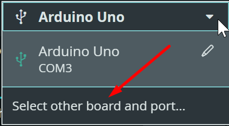
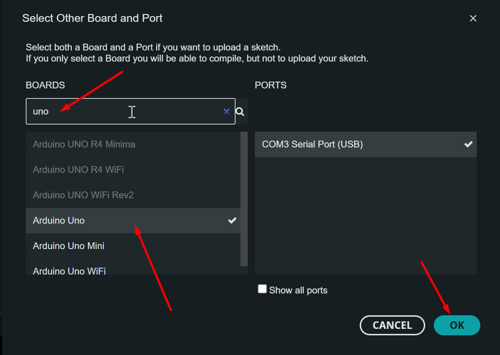
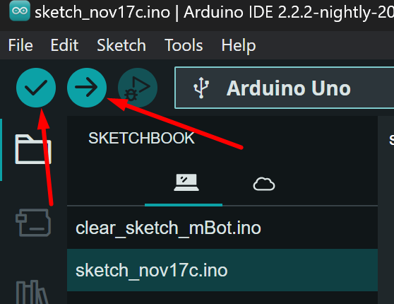

# Programuj mBota na Arduino IDE

Do programowania mCore z C/C++, potrzebne będzie Arduino IDE. Oto kroki które powinienieś wykonać:

1. [Pobierz](https://www.arduino.cc/en/software/) i zainstaluj odpowiednie Arduino IDE.

2. Pobierz i zainstaluj sterownik CH340 wymagany przez mCore (zrestartuj komputer po instalacji)

    - [CH340 dla Windows](https://www.wch-ic.com/downloads/CH341SER_EXE.html)
    - [CH340 dla MacOS](https://www.wch-ic.com/downloads/CH341SER_MAC_ZIP.html)

3. Otwórz Arduino IDE, podążaj za [dokumentacją](https://github.com/Makeblock-official/Makeblock-Libraries) aby pobrać i skonfigurować **makeblock-library**.

4. Aby rozpocząć pierwszy program musimy mieć podłączonego mBota poprzez fizyczny kabel USB. Dodatkowo urządzenie powinno być włączone.

Następnie aktywujemy je jako urządzenie robocze w dwóch krokach:

Krok 1.

Krok 2.

W ostatnim etapie pozostało nam tylko uruchomić program.

> TIP: zamiast każdorazowo używać wyżej wskazanych przycisków, możemy skorzystać ze skrótów klawiszowych **CTRL + R** oraz **CTRL + U**
